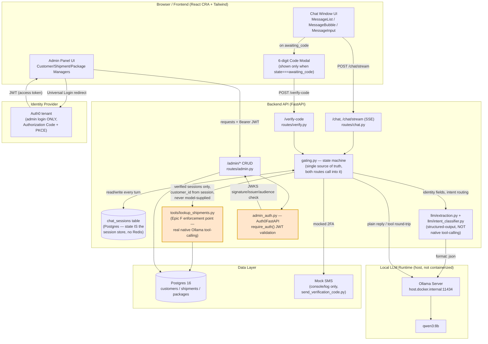

# High-level system architecture

Regenerated (2026-08-24, Week 5 Phase 1) against the real implementation.
Two structural corrections from the original target sketch: there is no
separate live Session Store — session state (including `collected_fields`,
the verification code, and attempt counters) lives directly in the
`chat_sessions` Postgres row and is read/written on every turn, no
in-memory/Redis layer. And the "Tool Layer" is only real native LLM
tool-calling for `lookup_shipments` (Epic F) — identity extraction and
intent routing are backend-orchestrated structured-output calls
(`llm/extraction.py`, `llm/intent_classifier.py`), not the model requesting
tools like `verify_identity`/`request_identity_info`.

