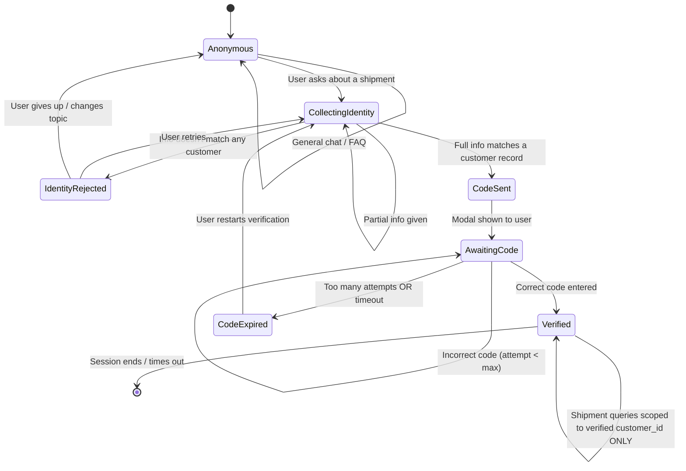

# Conversation / identity-gating state machine

The most important diagram in the program (Section 6.2) — the actual contract
the backend must enforce. Not implemented yet (no gating), but kept here as
the target for the identity-collection and 2FA work.

