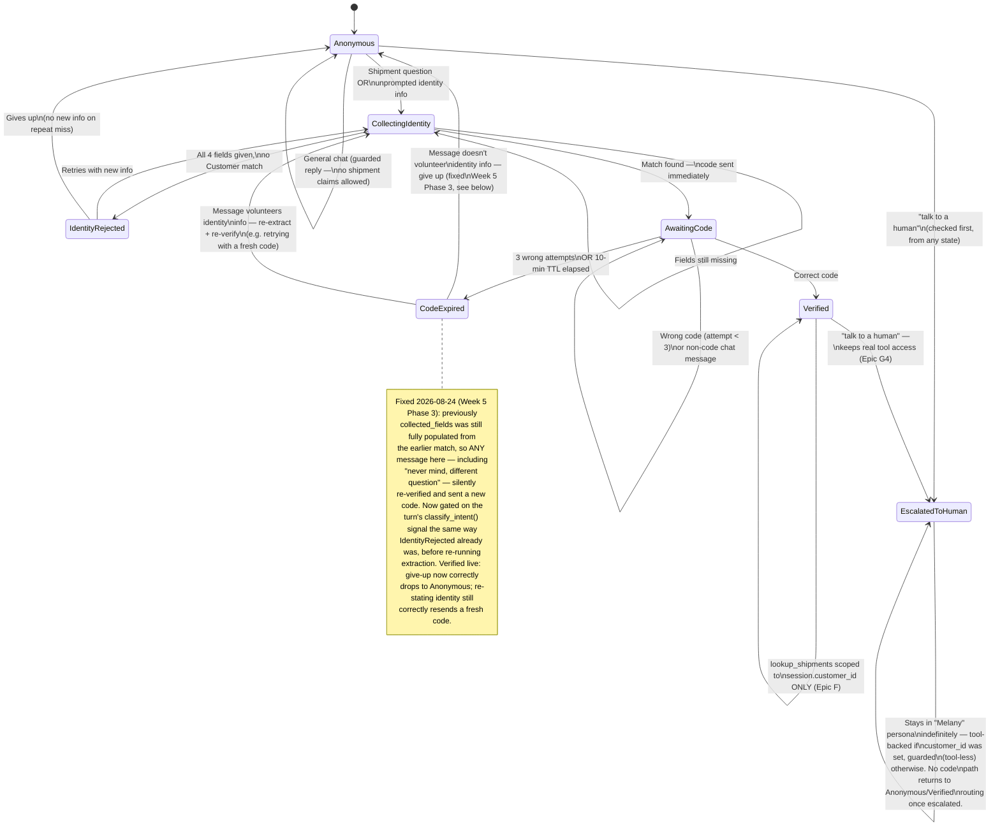

# Conversation / identity-gating state machine

Regenerated (2026-08-24, Week 5 Phase 1) against the real implementation in
`backend/gating.py` and `backend/models/chat_session.py`. Backend-orchestrated,
not model-driven: the LLM only phrases replies and extracts fields via
structured output (`llm/extraction.py`, `llm/intent_classifier.py`) — every
transition below is decided deterministically in `gating.py`, never by the
model choosing to call a tool. The `CodeSent` state from the original target
diagram is still defined in `SESSION_STATES` and handled defensively
alongside `AwaitingCode` by the router, but nothing in `gating.py` actually
assigns it — `CollectingIdentity` goes straight to `AwaitingCode`.

