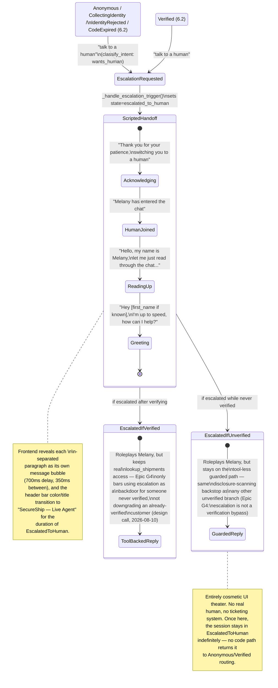

# Human escalation sequence (Epic G — cosmetic, scripted)

Regenerated (2026-08-24, Week 5 Phase 1) against `backend/gating.py`'s
`_handle_escalation_trigger`/`_handle_escalated_chat` and
`frontend/src/components/ChatWindow/ChatWindow.js`. Two corrections from
the original target: the staged reveal is driven by the frontend splitting
the backend's `\n\n`-separated reply into paragraphs and revealing each with
a 700ms/350ms delay (not a single "color shift" event), and the chat header
bar transitions color and its title changes to "SecureShip — Live Agent" —
it doesn't repaint the whole window. Also, unlike the original target,
nothing in the real state machine ever transitions back out of
`EscalatedToHuman` — see `02-conversation-state-machine.md`'s note.

