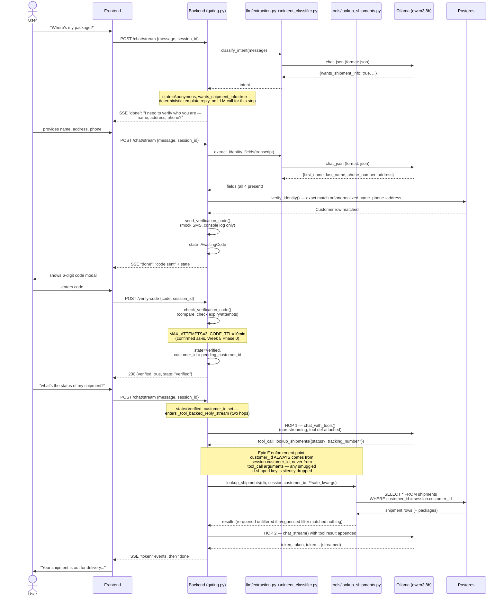

# Chat + tool-calling sequence — HTTP/SSE path (Section 6.3)

Regenerated (2026-08-24, Week 5 Phase 1) against the real implementation.
This is a substantial rewrite of the original target, which assumed the
model drives every step via native tool calls (`request_identity_info()`,
`verify_identity()`). The real design (confirmed Week 2, see PROGRESS.md)
is backend-orchestrated: identity collection and verification are
deterministic backend logic plus structured-output extraction calls, never
model-initiated tool calls. **Native Ollama tool-calling is used for exactly
one thing** — `lookup_shipments`, gated to `Verified` sessions only — and
even that is a two-hop round trip (a non-streaming call to get the tool
request, then a separate streaming call for the final prose), not a single
request/response. The transport is HTTP with Server-Sent Events
(`POST /chat/stream`), not the plain request/response Section 6.3 sketched
— WebSocket (6.3b) was never adopted, see `05-tool-calling-sequence-websocket.md`.

