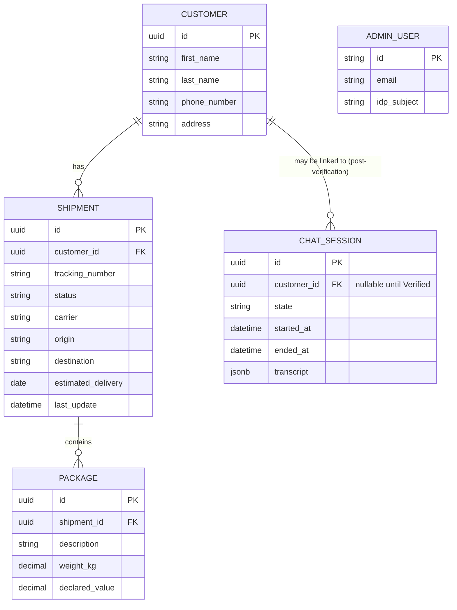

# Data model (ERD)

From Section 6.4. This is the schema the seeded mock data and the real
Postgres tables (`backend/models/`) conform to.

> `ADMIN_USER` identity actually lives in Auth0; a local-DB row (if mirrored)
> is a reference/audit record only, not the credential source of truth.
> `CHAT_SESSION.transcript` is the Postgres JSONB column from Section 4.6,
> implemented in `backend/models/chat_session.py`. `ADMIN_USER` itself is
> not implemented yet — that arrives with the admin panel/Auth0 work.
