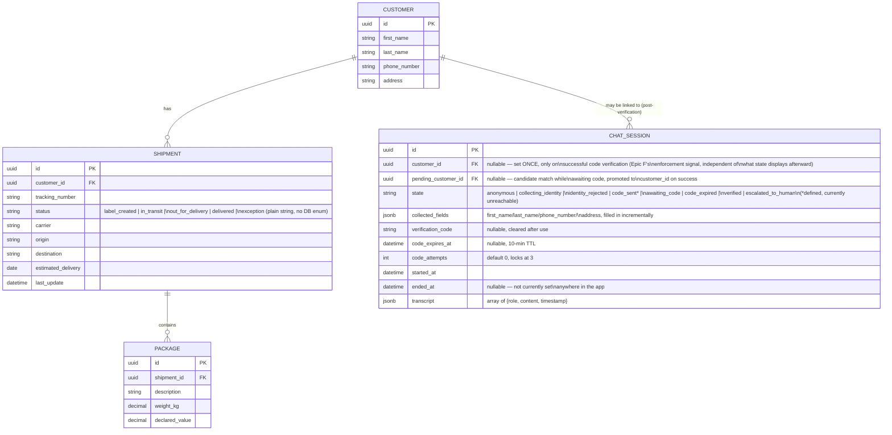

# Data model (ERD)

Regenerated (2026-08-24, Week 5 Phase 1) against the real SQLAlchemy models
in `backend/models/`. Two changes from the original target diagram:
`CHAT_SESSION` carries several fields the spec's high-level sketch omitted
(they're what actually implements Section 6.2's state machine), and
`ADMIN_USER` is gone entirely — per the Week 4 design call (confirmed
2026-08-24), Auth0 is the sole source of truth for admin identity and no
local table mirrors it, so there's nothing to diagram.

> `ADMIN_USER` is not a table in this schema — see the note above. Admin
> identity is validated per-request against Auth0's JWKS
> (`backend/admin_auth.py`), not looked up locally.
