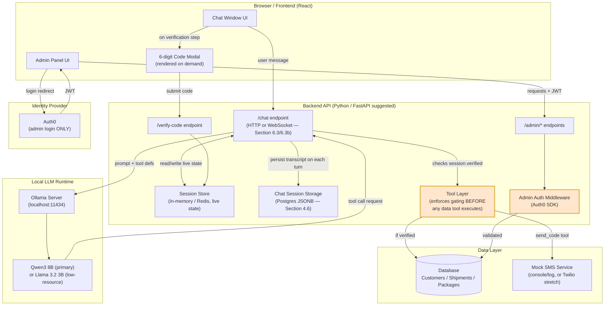
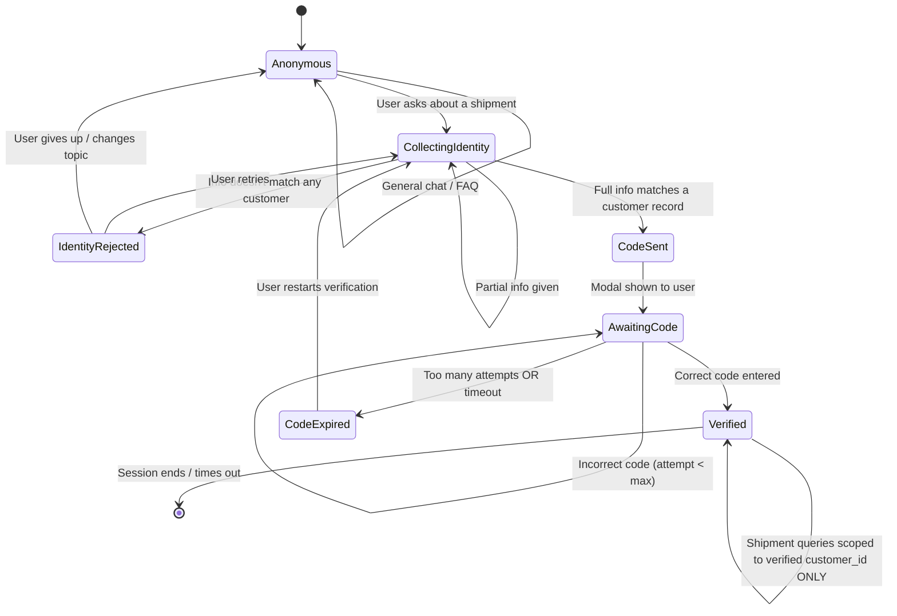
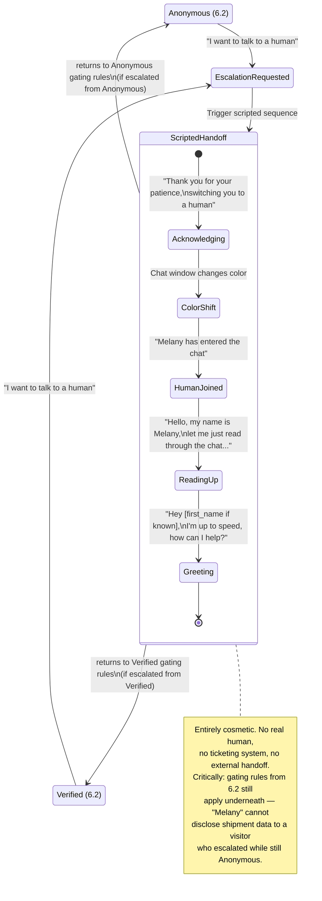
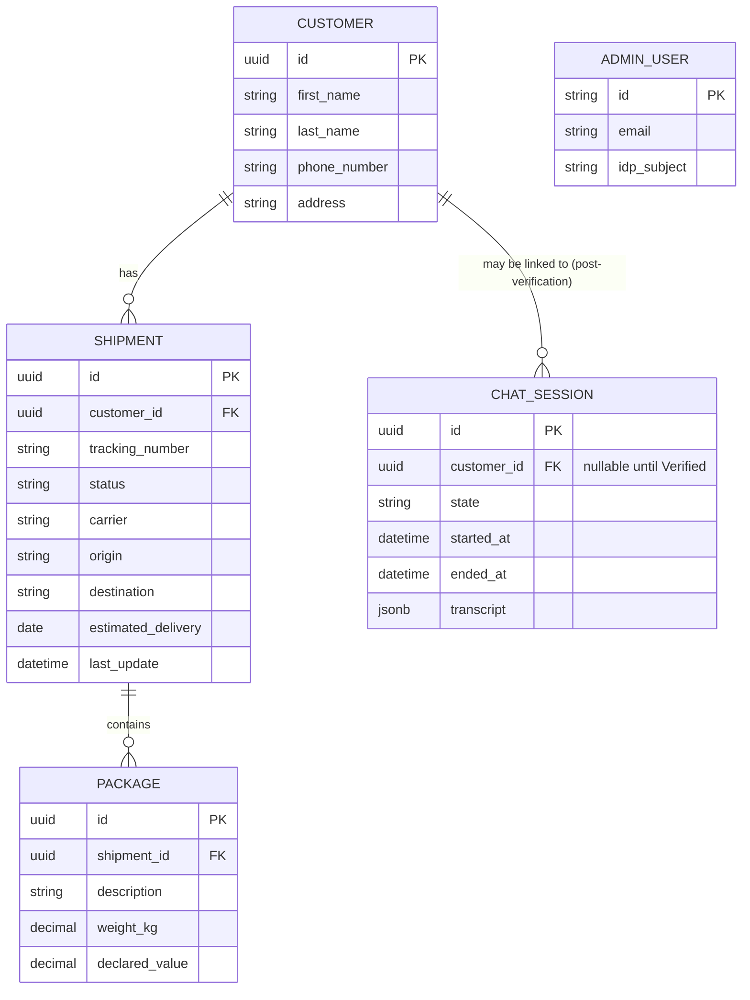
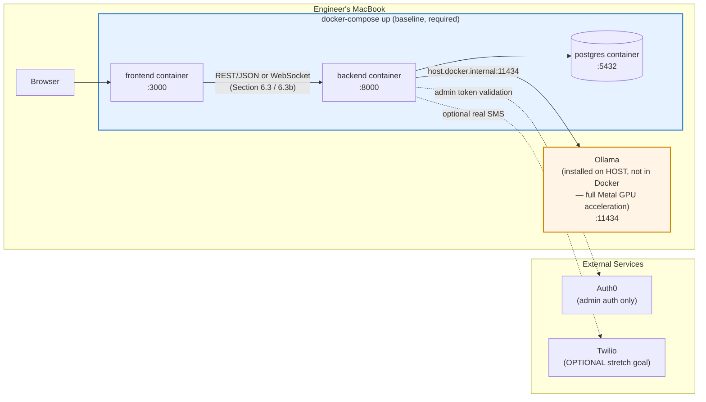
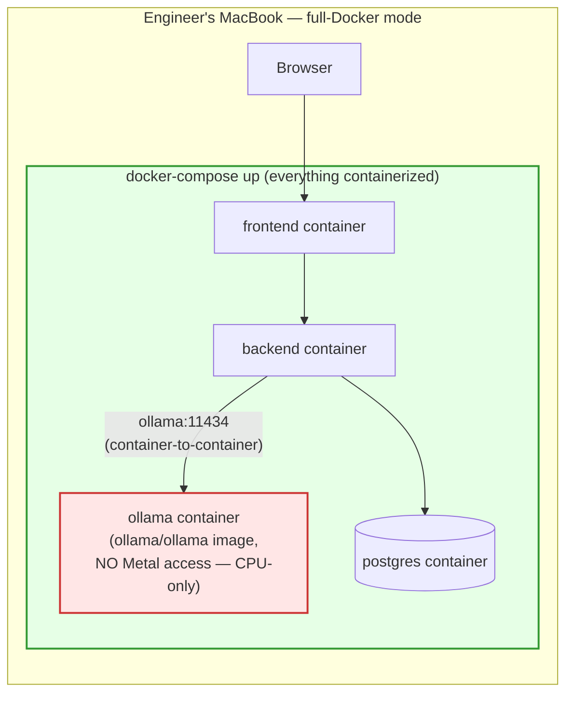

# 6. Architecture (Mermaid Diagrams)

[Index](../SecureShip-5Week-Program.md) · [Progress Tracker](../PROGRESS.md)

These are **starting diagrams** AI-generated for the program. Each team must regenerate these for their own implementation in Phase 5 (Week 5) — matching *their actual build* is what matters, not fidelity to this template.

**On HTTP vs. WebSockets (flagged early in Section 1.1):** Section 6.3 below shows the chat as HTTP request/response — this is the simpler baseline and fully acceptable. Section 6.3b shows the same flow over WebSockets, which is the architecturally better fit for a chat product: it supports server-pushed events (typing indicators, the verification code "arriving," an admin edit reflecting live in an open verified session) without the frontend having to poll. Both are valid choices with neither preferred over the other; pick one deliberately and reflect that choice consistently across your own diagrams in Week 5.

### 6.1 High-level system architecture



### 6.2 Conversation / identity-gating state machine

This is the most important diagram in the program — it's the actual contract the backend must enforce.



### 6.2b Human escalation sequence (Epic G — cosmetic, scripted)

Kept as its own small diagram rather than folded into 6.2, since it's a UI/UX theater layer that can trigger *from* either of the two main states (Anonymous or Verified) without actually changing the underlying gating logic — mixing it into the main state machine would clutter the diagram that's the program's real teaching point.



### 6.3 Tool-calling sequence (the gating enforcement point)

This shows *why* enforcement must live in the backend tool layer, not the model's prompt.

> **Typing note:** every payload below is a real REST request/response, so it's already fully covered by FastAPI's auto-generated OpenAPI schema — no extra work needed to get typed, codegen'd hooks on the frontend. See Section 4.8.

```mermaid
sequenceDiagram
    actor User
    participant FE as Frontend
    participant BE as Backend (Chat API)
    participant Session as Session Store
    participant LLM as Local LLM (Ollama)
    participant Tools as Tool Layer
    participant DB as Database

    User->>FE: "Where's my package?"
    FE->>BE: POST /chat {message, session_id}
    BE->>Session: get session state
    Session-->>BE: state = "Anonymous"
    BE->>LLM: prompt + tool defs + state context
    LLM-->>BE: tool_call: request_identity_info()
    BE->>FE: assistant message asking for name/address/phone
    FE->>User: shows message

    User->>FE: provides name, address, phone
    FE->>BE: POST /chat {message, session_id}
    BE->>LLM: prompt with collected fields
    LLM-->>BE: tool_call: verify_identity(fields)
    BE->>Tools: verify_identity(fields)
    Tools->>DB: match against Customer table
    DB-->>Tools: match found: customer_id=123
    Tools->>Session: set pending_customer_id=123, state="CodeSent"
    Tools-->>BE: result: code sent (mocked)
    BE->>FE: trigger modal display
    FE->>User: shows 6-digit code modal

    User->>FE: enters code
    FE->>BE: POST /verify-code {code, session_id}
    BE->>Tools: check_verification_code(code, session_id)
    Tools->>Session: compare code, check expiry/attempts
    Session-->>Tools: match, not expired
    Tools->>Session: set state="Verified", customer_id=123
    Tools-->>BE: verified = true
    BE-->>FE: 200 OK, chat unlocked

    User->>FE: "What's the status of my shipment?"
    FE->>BE: POST /chat {message, session_id}
    BE->>Session: get session state
    Session-->>BE: state="Verified", customer_id=123
    BE->>LLM: prompt + tool defs + verified context
    LLM-->>BE: tool_call: lookup_shipments(customer_id=123)
    BE->>Tools: lookup_shipments(customer_id=123)
    Note over Tools: Enforcement point:<br/>Tools layer ALWAYS uses<br/>session.customer_id, never<br/>a customer_id argument<br/>supplied by the model/user
    Tools->>DB: SELECT * FROM shipments WHERE customer_id=123
    DB-->>Tools: shipment rows
    Tools-->>BE: shipment data
    BE->>LLM: tool result
    LLM-->>BE: natural-language answer
    BE->>FE: assistant message
    FE->>User: "Your shipment is out for delivery..."
```



### 6.3b The same flow over WebSockets (recommended upgrade)

Functionally identical gating logic to 6.3 — the difference is entirely in the transport. The connection is opened once and stays open; the backend can push events (typing indicators, the code "arriving," a verified user's shipment status updating live if an admin edits it mid-conversation) without the frontend needing to ask. This is the stronger fit for a chat product, and the recommended path if a team has the bandwidth for it — but per Section 1.1 and the framing note above, it isn't preferred over the HTTP baseline in 6.3, just architecturally nicer.

> **Typing note:** the `emit(...)` payloads below (`typing`, `show_code_modal`, `verified`, `shipment_updated`, etc.) have no backing REST endpoint, so they won't appear in the OpenAPI schema automatically. This is the one real cost of choosing WebSockets over HTTP — see Section 4.8 for the dummy-endpoint workaround that still gets these typed without hand-writing duplicate TypeScript interfaces.

```mermaid
sequenceDiagram
    actor User
    participant FE as Frontend
    participant WS as Backend (WebSocket Gateway)
    participant Session as Session Store
    participant LLM as Local LLM (Ollama)
    participant Tools as Tool Layer
    participant DB as Database

    FE->>WS: connect (ws://.../chat?session_id=...)
    WS-->>FE: connection established

    User->>FE: "Where's my package?"
    FE->>WS: emit "message" {text}
    WS->>FE: emit "typing" (assistant is "typing")
    WS->>Session: get session state
    Session-->>WS: state = "Anonymous"
    WS->>LLM: prompt + tool defs + state context
    LLM-->>WS: tool_call: request_identity_info()
    WS->>FE: emit "message" (assistant asks for name/address/phone)

    User->>FE: provides name, address, phone
    FE->>WS: emit "message" {text}
    WS->>LLM: prompt with collected fields
    LLM-->>WS: tool_call: verify_identity(fields)
    WS->>Tools: verify_identity(fields)
    Tools->>DB: match against Customer table
    DB-->>Tools: match found: customer_id=123
    Tools->>Session: set pending_customer_id=123, state="CodeSent"
    Tools-->>WS: result: code sent (mocked)
    WS->>FE: emit "show_code_modal"  Note: pushed, not polled
    FE->>User: shows 6-digit code modal

    User->>FE: enters code
    FE->>WS: emit "verify_code" {code}
    WS->>Tools: check_verification_code(code, session_id)
    Tools->>Session: compare code, check expiry/attempts
    Session-->>Tools: match, not expired
    Tools->>Session: set state="Verified", customer_id=123
    Tools-->>WS: verified = true
    WS->>FE: emit "verified" (chat unlocked, no page reload needed)

    Note over WS,DB: Same enforcement point as 6.3:<br/>Tools layer ALWAYS uses session.customer_id,<br/>never a model/user-supplied id.<br/>Transport changed; gating contract did not.

    User->>FE: "What's the status of my shipment?"
    FE->>WS: emit "message" {text}
    WS->>Tools: lookup_shipments(customer_id=123)
    Tools->>DB: SELECT * FROM shipments WHERE customer_id=123
    DB-->>Tools: shipment rows
    Tools-->>WS: shipment data
    WS->>LLM: tool result
    LLM-->>WS: natural-language answer
    WS->>FE: emit "message" (assistant reply)

    Note over WS,FE: Bonus real-time win (HTTP can't do this easily):<br/>if an admin edits this shipment right now,<br/>the backend can emit "shipment_updated" and<br/>the open chat reflects it without a refresh.
```

### 6.4 Data model (ERD)



> Note: `ADMIN_USER` identity actually lives in Auth0; this row in the local DB (if a team chooses to mirror it) is just a reference/audit record, not the source of truth for credentials. `CHAT_SESSION.transcript` is the Postgres JSONB column described in Section 4.6.

### 6.5 Deployment / local dev topology



**Bonus tier — Ollama containerized too (optional, harder mode, CPU-only inside the container):**



> This second diagram is the "we went further" flex from Section 4.7 — genuinely harder to get right, and genuinely slower to use once it's working, since Docker Desktop on Mac can't pass Metal through to a container. Worth showing off at the final demo as a container-wiring exercise, but not expected of anyone, and not a performance upgrade over the baseline.

### 6.6 Repository skeleton (reference shape, not generated for you)

This is an **illustrative directory layout only** — there is no starter scaffold provided alongside this README. Per Section 7, teams use Claude Code in Week 1 to generate the actual project from scratch; this tree exists so a team has something to point Claude Code at ("set up a repo shaped roughly like this") rather than starting from a totally blank prompt.

```text
secureship/
├── docker-compose.yml
├── README.md                      # team's own README — AI-drafted, human-corrected (Section 7.1)
├── docs/
│   ├── certificates/               # Skilljar certs from Section 2's parallel learning track
│   └── diagrams/                   # Section 6 diagrams, regenerated against real build (Week 5)
│
├── frontend/
│   ├── Dockerfile
│   ├── package.json
│   ├── orval.config.ts             # Section 4.8 — points at backend's /openapi.json
│   └── src/
│       ├── api/
│       │   └── generated/          # Orval output — generated hooks + types, DO NOT hand-edit (Section 4.8)
│       ├── components/
│       │   ├── ChatWindow/         # Epic A — the core chat UI
│       │   ├── CodeModal/          # Epic C — on-demand 6-digit code modal
│       │   └── EscalationBanner/   # Epic G — cosmetic human-handoff theater
│       ├── admin/                  # Epic E — admin panel (Auth0-protected)
│       │   ├── CustomerManager/
│       │   ├── ShipmentManager/
│       │   └── ChatSessionViewer/  # OPTIONAL bonus (Section 8, Week 5) — read-only session browser
│       └── lib/
│           ├── chatTransport.ts    # HTTP fetch OR WebSocket client — Section 6.3/6.3b decision lives here
│           └── chatStore.ts        # Zustand store — WS path only (Section 4.8); not needed on the HTTP path
│
├── backend/
│   ├── Dockerfile
│   ├── requirements.txt
│   ├── main.py                     # app entrypoint, health-check route
│   ├── routes/
│   │   ├── chat.py                 # /chat (HTTP) or the WS gateway — Epic A/B/C/D
│   │   ├── verify.py               # /verify-code — Epic C
│   │   ├── admin.py                # /admin/* — Epic E, protected by Auth0 middleware
│   │   └── _types_chat_events.py   # WS PATH ONLY — dummy, never-called endpoints whose sole job
│   │                               #   is exporting the WS message-envelope Pydantic models into
│   │                               #   the OpenAPI schema for Orval/openapi-typescript (Section 4.8)
│   ├── tools/                      # Epic F — the enforcement layer, called by the model via tool-calling
│   │   ├── verify_identity.py
│   │   ├── send_verification_code.py
│   │   ├── check_verification_code.py
│   │   └── lookup_shipments.py     # ALWAYS scoped to session.customer_id — see Section 6.3 note
│   ├── llm/
│   │   └── ollama_client.py        # wraps calls to localhost:11434 (or host.docker.internal — Section 4.7)
│   ├── models/                     # ORM models: Customer, Shipment, Package, ChatSession (Section 4.4/4.6)
│   └── db/
│       └── session.py              # Postgres connection (and the JSONB ChatSession persistence — Section 4.6)
│
└── scripts/
    └── seed_data.py                 # Section 4.4 — mock data generation, schema-conformant
```

---

[← User Stories](05-user-stories.md)  ·  [AI-Assisted Workflow Requirements →](07-ai-workflow.md)  ·  [Index](../SecureShip-5Week-Program.md)
